# PlantUML Salt 文法まとめ

PlantUML の **Salt** は、GUI ライクなフォームやテーブルを **テキストベース**で定義するための構文です。以下にマークダウン形式で簡潔にまとめます。

---

## **基本構文**

```plantuml
@startuml
salt
{
  // ここにUI定義を書く
}
@enduml
```



- `salt` ブロック内でウィジェットやテーブルを定義します。
- GUI モックアップを作る際に便利です。

---

## **主なウィジェット**

### **1. ラベル**
```plantuml
salt
{
  "ラベルテキスト"
}
```
- ダブルクォーテーションで囲むとラベルとして表示されます。

---

### **2. ボタン**
```plantuml
salt
{
  [OK]
}
```
- 四角括弧 `[ ]` でボタンを作成します。

---

### **3. チェックボックス**
```plantuml
salt
{
  [ ] 未選択
  [X] 選択済み
}
```
- `[ ]` → 未選択
- `[X]` → 選択済み

---

### **4. ラジオボタン**
```plantuml
salt
{
  ( ) オプションA
  (X) オプションB
}
```
- `( )` → 未選択
- `(X)` → 選択済み

---

### **5. テキスト入力**
```plantuml
salt
{
  {入力してください}
}
```
- `{ }` 内にプレースホルダーを記述します。

---

### **6. テーブル**
```plantuml
salt
{
  {+
    "名前" | "年齢" | "職業"
    "太郎" | "20"   | "学生"
    "花子" | "25"   | "会社員"
  }
}
```
- `{+ ... }` でテーブルを作成。
- `|` で列を区切ります。

---

### **7. 区切り線**
```plantuml
salt
{
  ---
}
```
- `---` で横線を引きます。

---

## **レイアウト**

- Salt は **行単位**でレイアウトを決定します。
- 同じ行に複数のウィジェットを書くと **横並び**になります。

```plantuml
salt
{
  "ユーザー名" {username}
  "パスワード" {password}
  [ログイン] [キャンセル]
}
```

---

## **まとめ表**

| 構文          | 用途             | 例                   |
|---------------|------------------|----------------------|
| `"text"`      | ラベル           | `"名前"`             |
| `[label]`     | ボタン           | `[OK]`               |
| `[ ]` / `[X]` | チェックボックス | `[X] 同意する`       |
| `( )` / `(X)` | ラジオボタン     | `(X) 男`             |
| `{text}`      | 入力欄           | `{パスワード}`       |
| `{+ ... }`    | テーブル         | `{+ "列1" | "列2" }` |
| `---`         | 区切り線         | `---`                |
